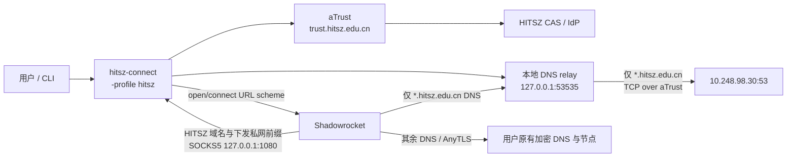

# HITSZ / aTrust 开发说明

## 目标与边界

本次改造在保留既有 EasyConnect/aTrust 功能的基础上新增 `-profile hitsz`。它解决的是
HITSZ aTrust 的统一认证和校内 DNS 可达性，而不是再实现一个代理内核：AnyTLS 及普通境外
代理均由 macOS Shadowrocket 负责。

HITSZ profile 的默认值为：

| 项目 | 值 |
| --- | --- |
| aTrust 网关 | `trust.hitsz.edu.cn:443` |
| CAS 域 | `hitcas` |
| 校内 DNS 上游 | `10.248.98.30:53/TCP` |
| 本地 DNS 中继 | `127.0.0.1:53535`（UDP 和 TCP） |
| DNS 边界 | 仅 `hitsz.edu.cn` 与其子域 |

profile 同时关闭 `fake-ip`、`dns-hijack` 和 macOS 系统 DNS 改写，避免干扰 Shadowrocket
已有的加密 DNS 与分流策略。它不会创建 `/etc/resolver` 条目，也不会调用 `networksetup`。

## 运行架构



其中 aTrust 通道与 Shadowrocket 的普通代理隧道相互独立。默认 gVisor 模式**不会**向 macOS
安装校内路由；Shadowrocket 必须把服务端下发的校园域名/私网前缀送到本地 SOCKS5，aTrust 才会
获得业务 TCP/UDP。Shadowrocket 仍保留对普通域名、订阅、AnyTLS 和加密 DNS 的控制权。

## 认证状态机

HITSZ 登录实现位于 `client/atrust/auth/hitsz_sso.go`，其流程依据脱敏浏览器抓包与
`hitsz-srun-login` 的公开 MFA 实现交叉验证。

1. 从 aTrust 的 CAS 登录入口获得 IdP 登录地址与 `service` 参数；只接受受限的 HTTPS
   IdP 主机，并验证 `service` 确实回调当前 aTrust 域和 `hitcas`。
2. 下载当前 IdP 登录页，解析表单及 `pwdEncryptSalt`，按 HITSZ 页面规则 AES-CBC 加密
   密码。用户名可以是手机号或学号。
3. 建立浏览器指纹 Cookie 后提交登录表单。请求使用浏览器形态的 User-Agent、平台和语言
   参数，避免误用其它 aTrust 租户的桌面客户端身份。
4. 如需要 MFA，读取 `tab_13` / `tab_3` 或兼容旧页的 `.changeReAuthTypes`：

   | 方法 | reAuthType | 动态码字段 |
   | --- | ---: | --- |
   | HITSZ App | `13` | `reAuthWeLinkDynamicCodeType` |
   | 短信 | `3` | `reAuthDynamicCodeType` |
   | 安全令牌 OTP | `10` | `otpCode` |

   App 与短信先切换认证类型并请求动态码；OTP 直接在本地生成。OTP 支持裸 Base32 种子和
   `otpauth://totp/...` URI，并固定为 SHA-1、30 秒周期、6 位数字。
5. MFA 的 AJAX 提交成功时通常仅返回确认 JSON，而不直接给出 CAS callback。实现随后以
   原始 `service` 再次访问 IdP 登录入口，跟随跳转直到真正的 aTrust CAS callback。HTTPS
   默认端口 `:443` 与省略端口的 URL 在比较时等价，修复了回调缺失误判。
6. 把 callback 交回 aTrust；随后刷新 `authConfig`，执行不致命的环境过渡，再进行
   `authCheck`，继续既有 aTrust 二次认证链。

Cookie 持久化会保留必要属性，旧 `-client-data-file` 自动兼容读取。新状态文件以 `0600`
写入；日志和跳转轨迹会屏蔽 query 值，避免暴露 ticket 或会话标识。

## DNS 中继设计

实现位于 `service/hitsz_dns_relay.go`，并由 `main.go` 在 aTrust 成功启动后注册。设计目标
是“只为 HITSZ 做最小例外”，不让其它域名因为校园网络而绕过 Shadowrocket。

- 同时监听 loopback UDP/TCP，客户端可以使用任一协议；收到的上游请求一律通过 aTrust 的
  `DialTCP` 连接 `10.248.98.30:53`。
- 查询名做大小写与尾点规范化。消息的每一个问题都必须为 `hitsz.edu.cn` 或
  `*.hitsz.edu.cn`，否则返回 DNS `REFUSED`。
- aTrust 拨号、上游交换或超时失败时返回 `SERVFAIL`，没有系统 DNS、公共 DNS 或 UDP 上游
  回退路径。
- 服务关闭时关闭两个 listener，释放端口；启动 TCP listener 失败时已创建的 UDP listener
  会被关闭。

## Shadowrocket 集成

实现位于 `integration/shadowrocket`，仅支持 macOS：

- `-shadowrocket off|open|connect`：认证前根据 Shadowrocket 标记的运行中 `utun` 静默暂停已有隧道，
  在本地 SOCKS 和 relay 就绪后通过 `open -g -j` 隐藏恢复或连接。
- `-shadowrocket-update-subs`：请求 Shadowrocket 刷新订阅；订阅 URL 始终由 Shadowrocket
  自己保存。
- `-shadowrocket-add-node-file`：只从文件读取一条 `anytls://host:port` URI，拒绝多行或
  非 AnyTLS 内容，避免把节点凭据置于进程参数和日志中。
- `-shadowrocket-disconnect-on-exit` 默认关闭，防止退出 hitsz-connect 时断开用户原本已经连接
  的 Shadowrocket。
- `-shadowrocket-config-fragment <path>` 可生成当前 relay、SOCKS、域名及服务端下发私网
  前缀对应的可合并片段。规则必须放在 Shadowrocket 的通用私网 `DIRECT` 与 `FINAL` 之前。

桥接只确认 macOS 接受 URL，不声称 Shadowrocket 的 VPN 已建立；该状态没有可靠的公开回调。

## 生命周期与失败处理

启动顺序是：初始钩子（HITSZ profile 为 no-op DNS 变更）→ aTrust 登录/隧道 → 本地 SOCKS
绑定 → DNS relay → 可选配置片段生成 → 可选 Shadowrocket URL 调用。关闭顺序由终止钩子管理，
先释放 relay，再关闭 VPN；只有显式要求时才发送 Shadowrocket disconnect。

若 relay 无法绑定，程序失败退出而不是悄悄使用其它 DNS；若非 HITSZ 查询到达 relay，客户端
得到明确的 `REFUSED`。这些设计让 DNS 故障可见，而不会演变成隐蔽的数据泄漏。

## 代码地图

| 位置 | 职责 |
| --- | --- |
| `init.go`、`configs/config.go` | profile 默认值、CLI/TOML 选项和旧参数兼容。 |
| `client/atrust/auth/hitsz_sso.go` | CAS 表单、浏览器指纹、MFA、callback 与敏感 URL 脱敏。 |
| `client/atrust/auth/hitsz_totp.go` | TOTP URI/密钥解析与本地 SHA-1 OTP 生成。 |
| `client/atrust/auth/hitsz_otp_secret.go` | 权限受限的 OTP 文件读取与交互输入。 |
| `client/atrust/auth/cas.go` | CAS 后 aTrust 状态衔接。 |
| `service/hitsz_dns_relay.go` | HITSZ-only UDP/TCP DNS relay。 |
| `integration/shadowrocket/` | macOS Shadowrocket URL bridge、AnyTLS 校验与片段生成。 |
| `internal/hook_func/initial_func_darwin.go` | HITSZ 不触发系统 DNS 修改的启动约束。 |

## 验证记录

开发期间已完成以下不含真实凭据的验证：

```sh
go test ./...
go test -tags tun ./...
```

另外已在 macOS/Apple Silicon 环境实际验证 HITSZ OTP 登录、aTrust 成功启动、本地 DNS relay
启动以及 Shadowrocket `connect` URL 调用。真实 MFA、Cookie、OTP 种子、订阅与用户节点均未
写入测试 fixture 或本仓库。

手工验收应在不保存敏感输出的前提下覆盖：HITSZ App/短信/OTP 三种 MFA、
`dig @127.0.0.1 -p 53535 trust.hitsz.edu.cn`、一个非 HITSZ 查询应为 `REFUSED`，以及
Shadowrocket 连接后校内和境外访问同时可用。
